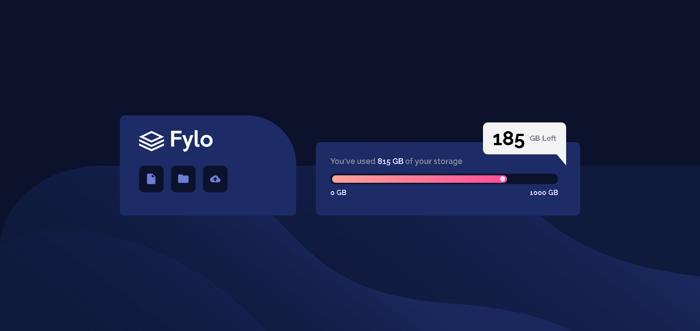

# Frontend Mentor - Fylo data storage component solution 

This is a solution to the [Fylo data storage component challenge on Frontend Mentor](https://www.frontendmentor.io/challenges/fylo-data-storage-component-1dZPRbV5n). Frontend Mentor challenges help you improve your coding skills by building realistic projects. 

## Table of contents

- [Overview](#overview)
  - [The challenge](#the-challenge)
  - [Screenshot](#screenshot)
  - [Links](#links)
  - [Author](#author)

## Overview

### The challenge

Users should be able to:

- View the optimal layout for the site depending on their device's screen size

### Screenshot

### Links

- Live Site URL: [live site URL](https://augustoaguado.github.io/Project-Fylo-Data-Storage-Component-Master/)

## Author

- GitHub - [AugustoAguado](https://github.com/AugustoAguado)

- Linkedin -[augusto-aguado](https://www.linkedin.com/in/augusto-aguado/)

